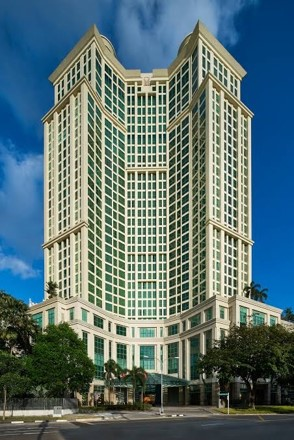

<head>
    
</head>

<body>

    

        
We're excited to inform you that the conference will be held at the <b>5-Star Grand Copthorne Waterfront Hotel</b>.

        
The hotel is situated along the Singapore River, near the Central Business District, and is a short walk from the Great World City Shopping Mall.

        
<u><b>Hotel name:</b></u> Grand Copthorne Waterfront Hotel

        
<u><b>Address:</b></u> 392 Havelock Road, Singapore 169663

        
<u><b>Website:</b></u> <a href="https://www.millenniumhotels.com/en/singapore/grand-copthorne-waterfront/?cid=gplaces-grand-copthorne-waterfront" style="color: blue;">https://www.millenniumhotels.com</a>

    

    

        

            
        

        

            <iframe src="https://www.google.com/maps/embed?pb=!1m18!1m12!1m3!1d3988.806298167315!2d103.83245267509436!3d1.2905215617634156!2m3!1f0!2f0!3f0!3m2!1i1024!2i768!4f13.1!3m3!1m2!1s0x31da199d143e0827%3A0xe0257bc3e02dddbb!2sGrand%20Copthorne%20Waterfront%20Hotel%20Singapore!5e0!3m2!1sfr!2ssg!4v1724840908465!5m2!1sfr!2ssg" allowfullscreen="" loading="lazy" referrerpolicy="no-referrer-when-downgrade"></iframe>
        

    

</body>